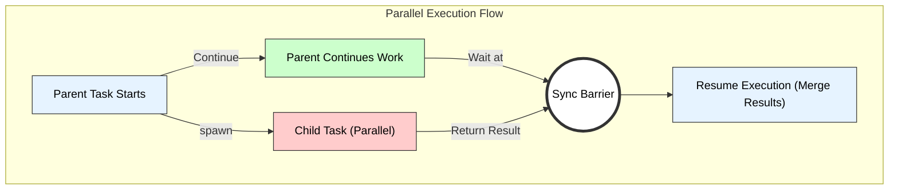

# Spawn and Sync in Multithreaded Programming

## 1. Introduction
The keywords `spawn` and `sync` form the basis of **Dynamic Multithreading** (specifically the **Fork-Join Model**). They are used in parallel programming languages (like Cilk, Cilk Plus, and parallel pseudocode) to define task parallelism explicitly.

---

## 2. Keyword: SPAWN (Fork)
* **Definition:** The `spawn` keyword is used to indicate that a specific function call or block of code can be executed **concurrently** (in parallel) with the code that follows it.
* **Mechanism:** When the parent thread encounters `spawn`, it creates a new logical thread of control (child task). The parent does not wait; it continues executing its own code immediately.
* **Technical Term:** This is known as a **Fork** operation.

## 3. Keyword: SYNC (Join)
* **Definition:** The `sync` keyword acts as a local **barrier** synchronization point.
* **Mechanism:** When a thread encounters `sync`, it pauses execution and waits until **all** tasks it has previously `spawn`ed have completed.
* **Constraint:** It only waits for its *direct* children, ensuring that the results from parallel tasks are ready before proceeding.
* **Technical Term:** This is known as a **Join** operation.

---

## 4. Pseudocode Example (Parallel Fibonacci)
This classic example calculates the $n$-th Fibonacci number by spawning a thread for $n-1$ while the main thread handles $n-2$.

```cpp
Algorithm P_Fib(n) {
    if (n <= 1) return n;
    
    x = spawn P_Fib(n - 1);  // Create child thread for (n-1)
    y = P_Fib(n - 2);        // Parent calculates (n-2) concurrently
    
    sync;                    // Wait for child 'x' to finish
    
    return x + y;            // Safe to add now
}
````

-----

## 5\. Visual Representation: Fork-Join DAG

The diagram below illustrates the control flow. The `spawn` creates a branch, and `sync` brings the branches back together.



## 6\. Summary

| Keyword | Role | Equivalent Concept |
| :--- | :--- | :--- |
| **spawn** | Creates parallelism | `fork()`, `Thread.start()`, `Async` |
| **sync** | Enforces synchronization | `join()`, `barrier`, `Await` |
---

# Spawn and Sync Keywords in Multithreaded Programming  
*(Clear, pointwise, technical keywords, small diagram — exam-ready)*

---

# 1. Introduction

In multithreaded and parallel programming, **spawn** and **sync** are keywords used to create and manage **parallel tasks** safely.

They are widely used in:
- Parallel languages (e.g., Cilk/Cilk++),  
- Task-parallel frameworks,  
- Multicore programming models.

---

# 2. Spawn Keyword

### **Definition**
`spawn` is used to indicate that a function or computation may be executed **in parallel** with the current thread.

### **Meaning**
- The function call after `spawn` becomes a **parallel task**.
- The parent thread **continues execution** without waiting for the spawned child.

### **Technical Keywords:**  
parallel invocation, asynchronous task, child thread, fork, parallel execution.

### **Example**

```text
spawn ComputeA();     // executed in parallel
ComputeB();           // executed by the parent thread
````

Both `ComputeA()` and `ComputeB()` may run *simultaneously* on different cores.

---

# 3. Sync Keyword

### **Definition**

`sync` is used to **wait** for all previously spawned tasks in the same function to **complete** before proceeding.

### **Meaning**

* Acts as a **barrier synchronization point**.
* Ensures that:

  > “All tasks spawned so far must finish before moving ahead.”

### **Technical Keywords:**

barrier, join, synchronization point, wait for child tasks.

### **Example**

```text
spawn ComputeA();
spawn ComputeB();
sync;                 // wait for A and B to finish
ComputeC();
```

`ComputeC()` will not start until both A and B complete.

---

# 4. Small Diagram (Spawn + Sync Workflow)

```text
Main Thread:
     |------ spawn A ------|
     |------ spawn B ------|
     |                     |
     |------- work --------|
                 ↓
               sync (wait)
                 ↓
            Continue Execution
```

At `sync`, the parent thread **joins** with all active spawned tasks.

---

# 5. Why Are Spawn and Sync Important?

### **1. Enable Parallelism**

`spawn` allows multiple functions to run **concurrently**, improving performance on multicore CPUs.

### **2. Maintain Correctness**

`sync` ensures all parallel tasks finish before dependent computations start.

### **3. Structured Parallelism**

They impose a clean **fork–join** model:

* `spawn` → fork (create parallel branch)
* `sync` → join (merge parallel branch)

### **4. Avoid Race Conditions**

`sync` ensures no subsequent code accesses incomplete or inconsistent results from spawned tasks.

---

# 6. Exam-Ready Summary

* **spawn**

  * Used to start a function or computation *in parallel*.
  * Parent does **not** wait for completion.

* **sync**

  * Ensures all spawned tasks in the current function complete.
  * Acts as a **barrier** or **join** point.

Together, `spawn` and `sync` form the basis of **task-parallel**, **fork–join multithreading** in modern parallel programming.

---

