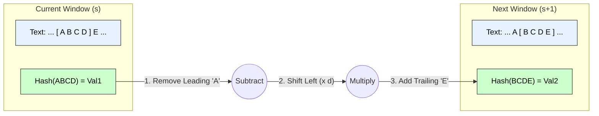

5mks

# Rabin-Karp String Matching Algorithm

## 1. Introduction
The **Rabin-Karp algorithm** is a string-searching algorithm that uses **hashing** to find a pattern string $P$ of length $m$ inside a text string $T$ of length $n$.

Unlike the Naive approach (which compares strings character by character), Rabin-Karp compares the **hash values** of the pattern and the current substring of the text. If the hash values match, it performs a character check to confirm.

---

## 2. Core Principle: Rolling Hash
The efficiency of Rabin-Karp relies on the **Rolling Hash** technique. Instead of calculating the hash of every substring from scratch (which takes $O(m)$), it updates the hash value from the previous window in $O(1)$ time.

**Mathematical Formula:**
Given a window hash $H_{old}$, the next window hash $H_{new}$ is calculated as:

$$H_{new} = (H_{old} - T[old\_char] \times d^{m-1}) \times d + T[new\_char] \pmod q$$

Where:
* $d$: Number of characters in the alphabet (radix, e.g., 256).
* $q$: A large prime number (to minimize collisions).
* $T[old\_char]$: The leading character being removed.
* $T[new\_char]$: The trailing character being added.

---

## 3. Algorithm Steps
1.  **Pre-processing:** Calculate the hash value of the Pattern $P$ and the first window of Text $T$.
2.  **Matching:** Iterate through the text:
    * Compare the hash of the current text window with the hash of $P$.
    * **Hit:** If hashes match, verify characters one by one (to handle hash collisions/spurious hits).
    * **Miss:** If hashes differ, slide the window one step to the right.
3.  **Rolling Update:** Calculate the hash of the new window using the rolling hash formula.

---

## 4. Pseudocode

```cpp
Algorithm Rabin_Karp(Text T, Pattern P, radix d, prime q) {
    n = length(T);
    m = length(P);
    h = d^(m-1) mod q; // Pre-computed multiplier
    p = 0; // Pattern hash
    t = 0; // Text window hash

    // 1. Calculate initial hashes
    for i = 0 to m-1 {
        p = (d * p + P[i]) mod q;
        t = (d * t + T[i]) mod q;
    }

    // 2. Slide the window
    for s = 0 to n - m {
        // A. Check Hash Match
        if (p == t) {
            // B. Check Characters (Handle Spurious Hits)
            if (CheckChars(T, P, s, m)) {
                print("Pattern found at index " + s);
            }
        }

        // C. Calculate Rolling Hash for next window
        if (s < n - m) {
            t = (d * (t - T[s] * h) + T[s+m]) mod q;
            if (t < 0) t = t + q; // Handle negative modulo result
        }
    }
}
````

-----

## 5\. Visual Representation: Rolling Hash

The diagram below illustrates how the window moves and updates the hash efficiently.



-----

## 6\. Complexity Analysis

| Scenario | Time Complexity | Explanation |
| :--- | :--- | :--- |
| **Pre-processing** | $O(m)$ | Calculating the initial hash of the pattern and first window. |
| **Average Case** | **$O(n + m)$** | Hash values are usually distinct. The rolling hash update takes constant time $O(1)$. |
| **Worst Case** | **$O(nm)$** | Occurs if there are many **Spurious Hits** (hash collisions). The algorithm is forced to check characters ($O(m)$) for every window ($n$ times). Example: $T=$ "AAAA...", $P=$ "AAA". |
---

# Rabin–Karp String Matching Algorithm  
*(Clear, pointwise, technical keywords, small diagram — exam-ready)*

---

# 1. Introduction

The **Rabin–Karp algorithm** is a pattern-matching algorithm used to find all occurrences of a **pattern string** `p` (length = m) in a **text string** `t` (length = n).

### **Key Idea**
Instead of comparing strings directly, Rabin–Karp uses a **hash function** to convert strings into numerical values.

- Compare **hash(p)** with **hash of substring** of `t`.
- If hashes match → verify by character comparison.
- Use **rolling hash** to efficiently compute next window hash.

### **Technical Keywords:**  
rolling hash, modular arithmetic, collision, window sliding, substring hashing.

---

# 2. Hash Function Used

For base `d` (alphabet size) and prime modulus `q`:

\[
h(s) = (s[0] \cdot d^{m-1} + s[1] \cdot d^{m-2} + \dots + s[m-1]) \bmod q
\]

The **rolling hash** for next window:

\[
h_{i+1} = (d(h_i - t[i] \cdot d^{m-1}) + t[i+m]) \bmod q
\]

This allows constant-time hash updates.

---

# 3. Rabin–Karp Algorithm (Pseudocode)

```text
Algorithm RabinKarp(t, n, p, m)

1. Choose base d and large prime q
2. Compute hash_p = hash of pattern p
3. Compute hash_t = hash of first window of text t[0..m-1]

4. For i ← 0 to n - m do

       // Step 1: Compare hash values
       If hash_p == hash_t then
             // Step 2: Exact match check (to avoid collisions)
             If p == t[i .. i+m-1] then
                    Report match at position i

       // Step 3: Compute hash of next window
       If i < n - m then
             hash_t = (d * (hash_t - t[i]*h) + t[i+m]) mod q
             If hash_t < 0 then
                    hash_t = hash_t + q
````

Where:

* `h = d^(m-1) mod q` is used to remove the contribution of the leftmost character.

---

# 4. Example (Concept Diagram)

```text
Text t:     A B C D A B C X
Pattern p:      C D A

Window 1: [A B C] → hash1
Window 2:   [B C D] → hash2
Window 3:     [C D A] → hash3 (matches)
Window 4:       [D A B] → hash4
...

Only when hash matches → do full comparison.
```

This sliding-window approach avoids rehashing each substring from scratch.

---

# 5. Explanation of Steps

### **Step 1 — Preprocessing**

* Compute hash of pattern and first window of text.
* Time: O(m)

### **Step 2 — Sliding the Window**

For each shift:

* Compare hash(p) with hash(window).
* Update window hash in O(1) using rolling hash formula.

### **Step 3 — Collision Checking**

If hash values match:

* Perform full match verification (O(m))

This ensures correctness even when hash collisions occur.

---

# 6. Time Complexity

### **Best / Expected Time:**

Hash collisions are rare if `q` is large.

[
O(n + m)
]

### **Worst Case:**

If many collisions occur:

[
O(nm)
]

Occurs when:

* Poor choice of hash or small modulus `q`
* Adversarial input causing repeated hash matches

---

# 7. Advantages

* Efficient for **multiple pattern matching**
* Rolling hash gives **fast updates** (O(1))
* Good for **pattern searching in large texts** (e.g., plagiarism checking)

---

# 8. Final Exam-Ready Summary

* **Rabin–Karp** uses **hashing + sliding window** for string matching.
* Steps:

  1. Compute hash of pattern and first window
  2. Slide window, update hash in O(1)
  3. Compare hashes, verify on match
* **Expected time**:
  [
  O(n + m)
  ]
* **Worst time**:
  [
  O(nm)
  ]
* Efficient for large text searches and multi-pattern matching due to rolling hash.

---


