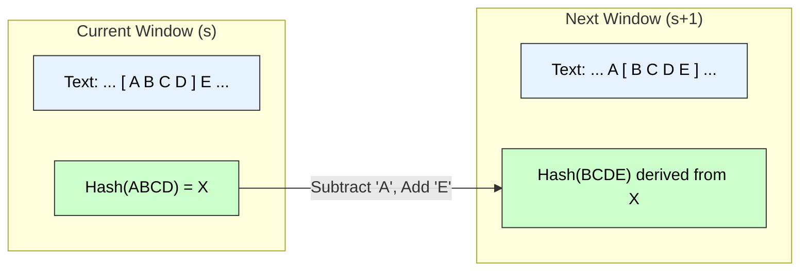

# Distributed MST & Rabin-Karp Algorithm

## Part A: Distributed Minimum Spanning Tree (GHS Algorithm)

### 1. Algorithm Overview
The **GHS Algorithm** (Gallager, Humblet, Spira) is the standard distributed algorithm for constructing a Minimum Spanning Tree (MST) in a weighted undirected graph where nodes represent processors.

**Key Concepts:**
* **Fragment:** A connected subgraph of the MST. Initially, every node is a fragment of size 1.
* **MOE (Minimum Outgoing Edge):** The edge with the minimum weight connecting a node within a fragment to a node *outside* it.
* **Levels:** A measure of the fragment size. Single nodes are Level 0.

### 2. Algorithm Steps
The algorithm proceeds in phases of **Finding** MOEs and **Merging** fragments.

1.  **Wake-up:** Nodes identify their incident edges.
2.  **Find Phase:** The root of a fragment broadcasts a message to all nodes in the fragment to find their local minimum weight edge connecting to a different fragment.
3.  **Select MOE:** The best edge is reported back to the root.
4.  **Merge Phase:** Fragments connect via their MOE.
    * If two fragments of the same level merge, the new level is $Level + 1$.
    * If a smaller level fragment merges into a larger one, it is absorbed (level does not change).

### 3. Diagram: Fragment Merging

```mermaid
graph TD
    subgraph "Fragment A (Level 0)"
    A((Node A)) ---|"Internal"| B((Node B))
    end

    subgraph "Fragment B (Level 0)"
    C((Node C)) ---|"Internal"| D((Node D))
    end

    B -.-|"MOE (Weight 2)"| C
    A -.-|"Rejected (Weight 10)"| D

    style A fill:#e6f3ff,stroke:#333,color:#000
    style B fill:#e6f3ff,stroke:#333,color:#000
    style C fill:#ccffcc,stroke:#333,color:#000
    style D fill:#ccffcc,stroke:#333,color:#000
    
    linkStyle 2 stroke-width:4px,stroke:#00aa00;

```

-----

## Part B: Rabin-Karp String Matching Algorithm

### 1\. Algorithm Principle

The **Rabin-Karp algorithm** uses **Hashing** to find a pattern string $P$ (length $m$) inside a text string $T$ (length $n$). Instead of comparing strings character by character, it compares their hash values.

**Key Concept: Rolling Hash**
To avoid re-calculating the hash for every substring, it uses a rolling hash function:
$$H(txt[s+1 \dots s+m]) = (H(txt[s \dots s+m-1]) - txt[s] \cdot d^{m-1}) \cdot d + txt[s+m]$$

  * Removes the leading character.
  * Adds the trailing character.
  * All operations are done modulo $q$ (a large prime) to avoid overflow.

### 2\. Pseudocode

**Input:** Text $T$ (length $n$), Pattern $P$ (length $m$).
**Parameters:** $d$ (radix, e.g., 256), $q$ (large prime).

```cpp
Algorithm RabinKarp(T, P, d, q) {
    n = length(T);
    m = length(P);
    h = d^(m-1) mod q;
    p = 0; // Hash value for pattern
    t = 0; // Hash value for text window

    // 1. Pre-processing: Calculate hash of P and first window of T
    for i = 0 to m-1 {
        p = (d * p + P[i]) mod q;
        t = (d * t + T[i]) mod q;
    }

    // 2. Matching Loop
    for s = 0 to n - m {
        // Check if hash values match
        if (p == t) {
            // Spurious Hit Check: Brute-force verify characters
            if (P[0...m-1] == T[s...s+m-1]) {
                print("Pattern found at index " + s);
            }
        }

        // Calculate hash for next window (Rolling Hash)
        if (s < n - m) {
            t = (d * (t - T[s] * h) + T[s+m]) mod q;
            if (t < 0) t = t + q; // Handle negative modulo result
        }
    }
}
```

### 3\. Diagram: Rolling Hash Window



### 4\. Complexity Analysis

| Scenario | Time Complexity | Reason |
| :--- | :--- | :--- |
| **Pre-processing** | $O(m)$ | Calculating initial hashes. |
| **Expected / Average Case** | **$O(n + m)$** | Hash collisions are rare. The rolling hash update takes $O(1)$. |
| **Worst Case** | **$O(nm)$** | Occurs if many "Spurious Hits" happen (all substrings have the same hash as $P$). e.g., $T=$ "AAAAA", $P=$ "AAA". |
