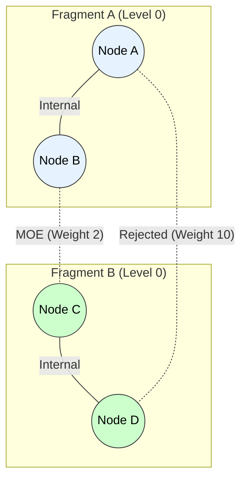
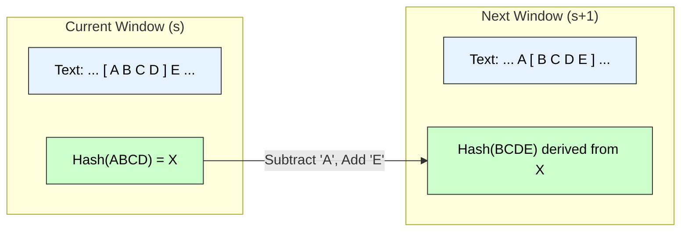

# Distributed MST & Rabin-Karp Algorithm

## Part A: Distributed Minimum Spanning Tree (GHS Algorithm)

### 1. Algorithm Overview
The **GHS Algorithm** (Gallager, Humblet, Spira) is the standard distributed algorithm for constructing a Minimum Spanning Tree (MST) in a weighted undirected graph where nodes represent processors.

**Key Concepts:**
* **Fragment:** A connected subgraph of the MST. Initially, every node is a fragment of size 1.
* **MOE (Minimum Outgoing Edge):** The edge with the minimum weight connecting a node within a fragment to a node *outside* it.
* **Levels:** A measure of the fragment size. Single nodes are Level 0.

### 2. Algorithm Steps
The algorithm proceeds in phases of **Finding** MOEs and **Merging** fragments.

1.  **Wake-up:** Nodes identify their incident edges.
2.  **Find Phase:** The root of a fragment broadcasts a message to all nodes in the fragment to find their local minimum weight edge connecting to a different fragment.
3.  **Select MOE:** The best edge is reported back to the root.
4.  **Merge Phase:** Fragments connect via their MOE.
    * If two fragments of the same level merge, the new level is $Level + 1$.
    * If a smaller level fragment merges into a larger one, it is absorbed (level does not change).

### 3. Diagram: Fragment Merging



-----

## Part B: Rabin-Karp String Matching Algorithm

### 1\. Algorithm Principle

The **Rabin-Karp algorithm** uses **Hashing** to find a pattern string $P$ (length $m$) inside a text string $T$ (length $n$). Instead of comparing strings character by character, it compares their hash values.

**Key Concept: Rolling Hash**
To avoid re-calculating the hash for every substring, it uses a rolling hash function:
$$H(txt[s+1 \dots s+m]) = (H(txt[s \dots s+m-1]) - txt[s] \cdot d^{m-1}) \cdot d + txt[s+m]$$

  * Removes the leading character.
  * Adds the trailing character.
  * All operations are done modulo $q$ (a large prime) to avoid overflow.

### 2\. Pseudocode

**Input:** Text $T$ (length $n$), Pattern $P$ (length $m$).
**Parameters:** $d$ (radix, e.g., 256), $q$ (large prime).

```cpp
Algorithm RabinKarp(T, P, d, q) {
    n = length(T);
    m = length(P);
    h = d^(m-1) mod q;
    p = 0; // Hash value for pattern
    t = 0; // Hash value for text window

    // 1. Pre-processing: Calculate hash of P and first window of T
    for i = 0 to m-1 {
        p = (d * p + P[i]) mod q;
        t = (d * t + T[i]) mod q;
    }

    // 2. Matching Loop
    for s = 0 to n - m {
        // Check if hash values match
        if (p == t) {
            // Spurious Hit Check: Brute-force verify characters
            if (P[0...m-1] == T[s...s+m-1]) {
                print("Pattern found at index " + s);
            }
        }

        // Calculate hash for next window (Rolling Hash)
        if (s < n - m) {
            t = (d * (t - T[s] * h) + T[s+m]) mod q;
            if (t < 0) t = t + q; // Handle negative modulo result
        }
    }
}
```

### 3\. Diagram: Rolling Hash Window



### 4\. Complexity Analysis

| Scenario | Time Complexity | Reason |
| :--- | :--- | :--- |
| **Pre-processing** | $O(m)$ | Calculating initial hashes. |
| **Expected / Average Case** | **$O(n + m)$** | Hash collisions are rare. The rolling hash update takes $O(1)$. |
| **Worst Case** | **$O(nm)$** | Occurs if many "Spurious Hits" happen (all substrings have the same hash as $P$). e.g., $T=$ "AAAAA", $P=$ "AAA". |
---

# Q1) Distributed Minimum Spanning Tree (MST) Algorithm  
*(Clear, pointwise, technical, with small diagram)*

---

## 1. Problem Definition

Given:

- A **connected, weighted, undirected graph**  
- Vertices and edges are **distributed** over a set of processors (nodes) in a network  
- Communication between processors is via **message passing**

**Goal:**  
Compute a **Minimum Spanning Tree (MST)** in a **distributed manner**, without a central controller.

---

## 2. Algorithm Used: GHS Algorithm  
*(Gallager–Humblet–Spira Distributed MST Algorithm)*

### Basic Idea

- Each node starts as an individual **fragment** (component).  
- Repeatedly:
  1. Each fragment finds its **Minimum Outgoing Edge (MOE)**.  
  2. Fragments **merge** along these edges.  
  3. Continue until all vertices belong to **one fragment** (the MST).

### Technical Keywords  
fragment, minimum outgoing edge (MOE), merge, fragment ID, level, message passing, distributed MST.

---

## 3. Main Steps of GHS Algorithm

### Step 1: Initialization

- Each node is its **own fragment**.
- Each fragment has:
  - A **fragment ID** (often node ID)
  - A **level** (initially 0 or 1)
- Nodes know weights of their **incident edges**.

---

### Step 2: Finding Minimum Outgoing Edge (MOE)

For each fragment:

1. Every node examines **edges to neighbors**.  
2. It ignores edges **inside the same fragment**.  
3. It selects the **lightest edge leaving the fragment**.  
4. This edge is the **Minimum Outgoing Edge (MOE)** of that fragment.

---

### Step 3: Sending CONNECT and Merging Fragments

- Along the MOE, the fragment sends a **CONNECT** message to the neighboring fragment.
- Cases:
  - If both fragments have the **same level** → they **merge** and form a new fragment with **level + 1**.
  - If levels differ → the lower-level fragment joins the higher-level fragment.
- The **MOE edge is added to the MST**.

---

### Step 4: Repeating the Process

- After merging, the new fragment again finds its **MOE**.
- This process repeats:
  - Find MOE  
  - Send CONNECT  
  - Merge  
- Termination: when all nodes belong to **one fragment** → MST formed.

---

## 4. Small Conceptual Diagram (Fragment Merging)

```text
Initial (each node is its own fragment):

   A    B    C    D

Step 1: Each finds its MOE and merges:

   A──B      C──D

Step 2: New fragments find MOE and merge:

   A──B──────C──D   (final MST)
````

Each merge is done using the **lightest outgoing edge** between fragments.

---

# Q2) Rabin–Karp String Matching Algorithm

*(Pattern matching using hashing)*

---

## 1. Problem Definition

Given:

* **Text** string `t` of length `n`
* **Pattern** string `p` of length `m`
* Alphabet of size `d` (e.g., `d = 256` for ASCII)

**Goal:**
Find all occurrences of `p` in `t`.

---

## 2. Principle of Rabin–Karp

Use **hashing** to compare:

* Instead of comparing pattern `p` with every substring of length `m` directly,
* Compute a **hash value** for:

  * The pattern `p`
  * Every length-`m` substring of `t` using a **rolling hash**

If the hash of substring `t[i..i+m-1]` equals the hash of `p`,
then **verify** by direct character comparison (to avoid collisions).

---

## 3. Hash Function (Rolling Hash Idea)

A common hash function (mod `q`, a large prime):

For pattern `p[0..m-1]`:

[
h_p = \big(p[0] \cdot d^{m-1} + p[1] \cdot d^{m-2} + \dots + p[m-1] \big) \bmod q
]

For text window `t[i..i+m-1]`, its hash:

[
h_i = \big(t[i] \cdot d^{m-1} + t[i+1] \cdot d^{m-2} + \dots + t[i+m-1]\big) \bmod q
]

To move from window `i` to `i+1`:

[
h_{i+1} = \big(d(h_i - t[i]\cdot d^{m-1}) + t[i+m]\big) \bmod q
]

This allows **O(1)** time update per shift.

---

## 4. Rabin–Karp Algorithm (Pseudocode)

```text
Algorithm RabinKarp(t, n, p, m)
Input : t[0..n-1] → text
        p[0..m-1] → pattern
Output: All positions i where p occurs in t

1. Choose base d (e.g. 256) and large prime q
2. Compute:
       h = d^(m-1) mod q
       hash_p = 0
       hash_t = 0

3. // Preprocessing: hash of pattern and first window
   for j ← 0 to m-1 do
        hash_p = (d * hash_p + p[j]) mod q
        hash_t = (d * hash_t + t[j]) mod q

4. // Slide pattern over text
   for i ← 0 to n - m do

        // If hash values match, verify characters
        if hash_p == hash_t then
             if t[i..i+m-1] == p[0..m-1] then
                    report match at position i

        // Compute hash for next window (if any)
        if i < n - m then
             hash_t = (d * (hash_t - t[i] * h) + t[i + m]) mod q
             if hash_t < 0 then
                  hash_t = hash_t + q
```

---

## 5. Small Diagram (Sliding Window Concept)

```text
Text:    t[0] t[1] t[2] t[3] t[4] t[5] ...
Pattern:     p[0] p[1] p[2]

Window 1:  [ t[0] t[1] t[2] ]
Window 2:      [ t[1] t[2] t[3] ]
Window 3:          [ t[2] t[3] t[4] ]
...
For each window:
  → update hash_t using rolling hash
  → compare hash_t with hash_p
  → verify if needed
```

---

## 6. Time Complexity of Rabin–Karp

### 6.1 Preprocessing Time

* Computing initial hashes of `p` and first window of `t`:

[
O(m)
]

---

### 6.2 Expected (Average) Running Time

* For each of the `n - m + 1` windows:

  * Hash update in **O(1)**
  * Hash comparison in **O(1)**
  * Very few spurious hits (if good hash, large `q`)

Thus, **expected time**:

[
O(n + m)
]

---

### 6.3 Worst-Case Running Time

Worst case occurs when:

* There are **many hash collisions**, i.e., many windows have the same hash as the pattern.
* For each such window, we do a **full character comparison** of length `m`.

In the worst case:

* Up to `n - m + 1` windows
* Each requiring **O(m)** verification

So, **worst-case time**:

[
O\big((n - m + 1) \cdot m\big) = O(nm)
]

---

## 7. Final Exam-Ready Summary

* **Distributed MST Algorithm:**

  * Use **GHS algorithm**: fragments, Minimum Outgoing Edge (MOE), merging via CONNECT messages, repeated until single MST fragment remains.

* **Rabin–Karp Algorithm:**

  * Uses **rolling hash** to compare pattern `p` with all substrings of `t` of length `m`.
  * Hash comparison is fast; full comparison only on hash match.

* **Time Complexity of Rabin–Karp:**

  * Preprocessing:
    [
    O(m)
    ]
  * **Expected time:**
    [
    O(n + m)
    ]
  * **Worst-case time:**
    [
    O(nm)
    ]

---

