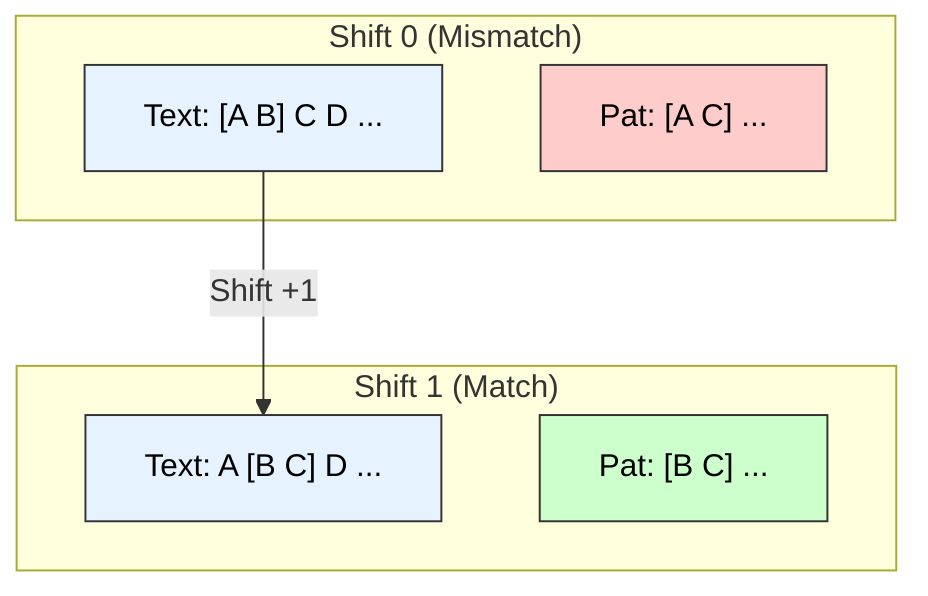
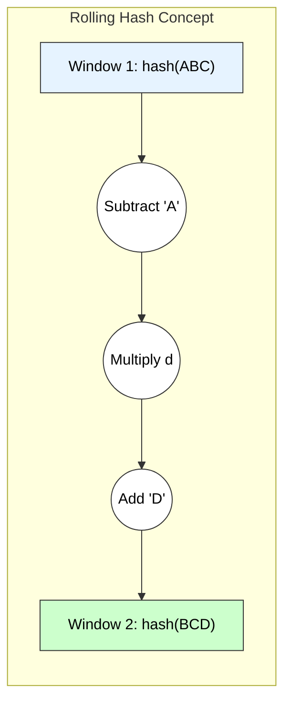

# String Matching Algorithms: Naïve vs. Rabin-Karp

## 1. Naïve String Matching Algorithm

### A. Principle
The **Naïve (Brute Force)** algorithm slides the pattern $P$ one character at a time along the text $T$. At each position $s$, it checks if the characters of $P[0 \dots m-1]$ match the characters of $T[s \dots s+m-1]$.

### B. Pseudocode
**Input:** Text $T$ (length $n$), Pattern $P$ (length $m$).

```cpp
Algorithm Naive_String_Match(T, P) {
    n = length(T);
    m = length(P);

    // Iterate through all possible shift positions
    for s = 0 to n - m {
        
        // Check for match at current position s
        j = 0;
        while (j < m and T[s + j] == P[j]) {
            j = j + 1;
        }

        // If j reached m, all characters matched
        if (j == m) {
            print("Pattern found at index " + s);
        }
    }
}
````

### C. Analysis

  * **Best Case:** $O(n)$. Occurs when the first character of the pattern never appears in the text.
  * **Worst Case:** $O((n-m+1) \times m) \approx O(nm)$. Occurs when the pattern exists at every position or nearly matches every position (e.g., $T=$ "AAAAA", $P=$ "AAA").
  * **Space Complexity:** $O(1)$.

### D. Visual Representation



-----

## 2\. Rabin-Karp Algorithm

### A. Principle

The **Rabin-Karp** algorithm uses **Hashing** to filter out non-matching positions. It calculates a hash value for the pattern and compares it with the hash of the current text window. It uses a **Rolling Hash** function to update the hash in $O(1)$ time when sliding the window.

**Rolling Hash Formula:**
$$t_{new} = (d \times (t_{old} - T[old] \times h) + T[new]) \mod q$$

### B. Pseudocode

**Input:** $T, P$, Radix $d$, Prime $q$.

```cpp
Algorithm Rabin_Karp(T, P, d, q) {
    n = length(T);
    m = length(P);
    h = d^(m-1) mod q; // Precompute high-order digit multiplier
    p = 0; // Pattern hash
    t = 0; // Text hash

    // Preprocessing
    for i = 0 to m-1 {
        p = (d * p + P[i]) mod q;
        t = (d * t + T[i]) mod q;
    }

    // Matching
    for s = 0 to n - m {
        // 1. Compare Hash
        if (p == t) {
            // 2. Verification (Handle Collisions)
            if (T[s...s+m-1] == P[0...m-1])
                print("Pattern found at index " + s);
        }

        // 3. Rolling Update
        if (s < n - m) {
            t = (d * (t - T[s] * h) + T[s+m]) mod q;
            if (t < 0) t = t + q;
        }
    }
}
```

### C. Analysis

  * **Best/Average Case:** $O(n + m)$. Occurs when hash collisions are rare (Spurious Hits are low).
  * **Worst Case:** $O(nm)$. Occurs when every window collides with the pattern hash (e.g., $T=$ "AAAAA", $P=$ "AAA", or a poor hash function).
  * **Space Complexity:** $O(1)$.

### D. Visual Representation



-----

## 3\. Comparison Summary

| Feature | Naïve Algorithm | Rabin-Karp Algorithm |
| :--- | :--- | :--- |
| **Technique** | Brute Force (Character-by-Character) | Hashing (Integer Comparison) |
| **Preprocessing** | None ($0$) | $O(m)$ (Initial Hash) |
| **Matching Time (Avg)** | $O(n)$ | $O(n)$ |
| **Matching Time (Worst)** | $O(nm)$ | $O(nm)$ |
| **Use Case** | Short texts, simple implementation | Multiple pattern search, plagiarism detection |

---

# Naïve String Matching vs Rabin–Karp Algorithm  
*(Pseudo code + analysis, clear, pointwise, exam-ready)*

---

## Given

- Text string `t` of length `n`
- Pattern string `p` of length `m`
- Goal: Find all occurrences of `p` in `t`

---

# 1. Naïve String Matching Algorithm

---

## 1.1 Idea (Principle)

- Try to **align pattern `p` at every possible position** `i` in text `t`  
- For each shift `i = 0 .. n - m`:
  - Compare `p[0..m-1]` with `t[i..i+m-1]` **character by character**
  - If all characters match → report a match at position `i`

### **Technical Keywords:**  
brute-force search, character-by-character comparison, sliding window, worst-case `O(nm)`.

---

## 1.2 Pseudo Code – Naïve String Matching

```text
Algorithm NaiveStringMatch(t, n, p, m)
Input : t[0..n-1] → text
        p[0..m-1] → pattern
Output: All positions i where p occurs in t

for i ← 0 to n - m do
      j ← 0
      while j < m and t[i + j] == p[j] do
            j ← j + 1

      if j == m then
            report "Pattern found at position" i
````

---

## 1.3 Time Complexity of Naïve Algorithm

* Outer loop runs: `n - m + 1` times
* Inner loop (in worst case): compares up to `m` characters each time

### Worst Case:

* Pattern and text share many common prefixes, e.g.

  * `t = "aaaaaaaaab"`
  * `p = "aaaaab"`
* For each shift, almost all `m` characters are compared.

**Time:**

[
T_{\text{worst}} = O\big((n - m + 1) \cdot m\big) = O(nm)
]

### Best Case:

* First character mismatches at each shift

[
T_{\text{best}} = O(n)
]

### Average Case:

* On random text and pattern:

[
T_{\text{avg}} \approx O(n + m)
]

(but commonly quoted as **O(nm)** in strict worst-case analysis).

### Space Complexity:

[
O(1)
]
(no extra significant memory used)

---

## 1.4 Small Diagram (Naïve Sliding Window)

```text
Text  t:  A  B  A  B  A  B  C
Pattern p:    A  B  A

Shift 0: [A  B  A] B  A  B  C  → match at 0
Shift 1:  A [B  A  B] A  B  C  → no match
Shift 2:  A  B [A  B  A] B  C  → match at 2
...
```

---

# 2. Rabin–Karp String Matching Algorithm

---

## 2.1 Idea (Principle)

* Instead of comparing characters each time, compute a **hash value** for:

  * pattern `p`
  * each length-`m` substring (window) of `t`
* If **hashes match**, then compare characters to confirm (to avoid collisions).
* Use a **rolling hash** to compute next window hash in **O(1)** time.

### **Technical Keywords:**

hash function, rolling hash, modular arithmetic, collision, sliding window.

---

## 2.2 Hash Function (Rolling Hash Idea)

Let:

* `d` = size of character set (e.g., 256 for ASCII)
* `q` = large prime number (to reduce collisions)

Pattern hash:

```text
hash_p = (p[0]*d^(m-1) + p[1]*d^(m-2) + ... + p[m-1]) mod q
```

Text window hash `hash_t` initially for `t[0..m-1]`, then updated by:

```text
hash_next = (d * (hash_t - t[i] * h) + t[i + m]) mod q
where h = d^(m-1) mod q
```

---

## 2.3 Pseudo Code – Rabin–Karp Algorithm

```text
Algorithm RabinKarp(t, n, p, m)
Input : t[0..n-1] → text
        p[0..m-1] → pattern
Output: All positions i where p occurs in t

1. Choose base d (e.g. 256) and a large prime q
2. Compute:
       h = d^(m-1) mod q
       hash_p = 0
       hash_t = 0

3. // Preprocessing: compute hash of pattern and first window of text
   for j ← 0 to m - 1 do
         hash_p = (d * hash_p + p[j]) mod q
         hash_t = (d * hash_t + t[j]) mod q

4. // Slide pattern over text
   for i ← 0 to n - m do

         // If hash values match, verify characters
         if hash_p == hash_t then
               match ← true
               for j ← 0 to m - 1 do
                     if t[i + j] != p[j] then
                           match ← false
                           break
               if match == true then
                     report "Pattern found at position" i

         // Compute hash for next window
         if i < n - m then
               hash_t = (d * (hash_t - t[i] * h) + t[i + m]) mod q
               if hash_t < 0 then
                     hash_t = hash_t + q
```

---

## 2.4 Time Complexity of Rabin–Karp

### Preprocessing:

* Compute initial hashes for pattern and first window:

[
O(m)
]

### Expected (Average) Case:

* For each of the `n - m + 1` shifts:

  * Update hash in **O(1)** time
  * Compare hashes in **O(1)** time
  * Very few collisions (with good `q`)

So:

[
T_{\text{expected}} = O(n + m)
]

### Worst Case:

* Hash collisions for many windows → many full `O(m)` comparisons.

Worst case time:

[
T_{\text{worst}} = O\big((n - m + 1) \cdot m\big) = O(nm)
]

### Space Complexity:

[
O(1)
]

---

## 2.5 Small Diagram (Sliding Window with Hash)

```text
Text t:    A  B  C  D  A  B  C  X
Pattern p:       C  D  A

Windows:
 [A  B  C]  D  A  B  C  X  → hash1
  A [B  C  D] A  B  C  X  → hash2
  A  B [C  D  A] B  C  X  → hash3 (matches hash_p)
         ↑  ↑  ↑
       verify characters → match confirmed
```

---

# 3. Comparative Summary (Naïve vs Rabin–Karp)

| Feature            | Naïve String Matching  | Rabin–Karp Algorithm       |
| ------------------ | ---------------------- | -------------------------- |
| Technique          | Direct char-comparison | Hashing + rolling hash     |
| Preprocessing Time | O(1)                   | O(m)                       |
| Expected Time      | O(nm) (simple view)    | O(n + m)                   |
| Worst-Case Time    | O(nm)                  | O(nm) (due to collisions)  |
| Extra Space        | O(1)                   | O(1)                       |
| Suitable For       | Small inputs, simple   | Large texts, multi-pattern |

---

# 4. Exam-Ready Conclusion

* **Naïve string matching** checks pattern at every position using **direct comparisons**, with worst-case time `O(nm)`.
* **Rabin–Karp** uses a **rolling hash**:

  * Compares hash values first, then confirms matches by character comparison.
  * Has **expected time** `O(n + m)` and **worst-case** `O(nm)`.
* Both are easy to implement, but Rabin–Karp is preferable when:

  * Searching multiple patterns
  * Working on large texts where hashing gives practical speedups.

---

